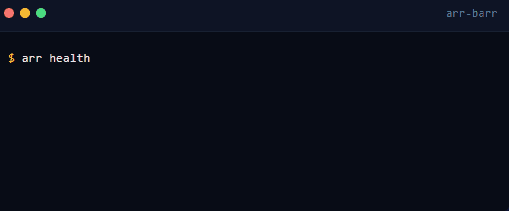

<div align="center">

# arrbarr.com

### The friendly face of the arr-barr stack.
### Scroll-animated. Dark-themed. Zero YAML required.

[Live Site](https://arrbarr.com) &nbsp;&middot;&nbsp; [arr-barr Stack](https://github.com/TrashedPandai/arr-barr) &nbsp;&middot;&nbsp; [Docs](https://arrbarr.com/docs)

---

**A visual companion to [arr-barr](https://github.com/TrashedPandai/arr-barr).**
Built for people who want to understand the stack before touching a terminal.

</div>

<br>

## Pages

| | Page | What's There |
|:---:|---|---|
| **01** | **[Home](https://arrbarr.com)** | Animated terminal demo, pipeline flow diagram, security overview |
| **02** | **[The Guide](https://arrbarr.com/guide)** | Step-by-step setup from zero to streaming |
| **03** | **[The Crew](https://arrbarr.com/crew)** | Visual roster of all 15 services grouped by role |
| **04** | **[Costs](https://arrbarr.com/costs)** | Pricing breakdown, hardware options, running cost comparison |
| **05** | **[Docs](https://arrbarr.com/docs)** | Interactive technical reference — network topology, quality scoring, CLI, troubleshooting |

## Design Language



The site mirrors the arr-barr CLI's visual identity:

- **Catppuccin Mocha** dark palette throughout
- **Color-coded groups** — green for network, yellow for indexers, blue for media, purple for streaming
- **Nautical metaphors** — the crew, the barr, the vault, the taproom
- **Gold accent** on primary CTAs and interactive highlights
- **GSAP scroll animations** — reveals, flow diagrams, SVG drawing, interactive pipeline

## Built With

| Tool | Role |
|---|---|
| **[Astro](https://astro.build)** v6 | Static site generator |
| **[GSAP](https://gsap.com)** | Scroll-triggered animations and SVG drawing |
| **[Lenis](https://lenis.darkroom.engineering/)** | Smooth scrolling |
| **[Cloudflare Pages](https://pages.cloudflare.com)** | Hosting and CDN |

## Development

```bash
npm install       # Install dependencies
npm run dev       # Dev server with hot reload
npm run build     # Production build
npm run preview   # Preview the build locally
```

## Deployment

Pushes to `main` auto-deploy via Cloudflare Pages. DNS is configured on Cloudflare with `arrbarr.com` and `www.arrbarr.com` pointing to the Pages project.

## Related

| | What |
|:---:|---|
| **[arr-barr](https://github.com/TrashedPandai/arr-barr)** | The stack itself — Docker Compose, CLI, configs |
| **[arrbarr.com](https://arrbarr.com)** | This site, live |

---

<div align="center">

**arr-barr** &nbsp;&middot;&nbsp; [Pandai Technologies](https://arrbarr.com)

*Every crew needs a port.*

</div>
